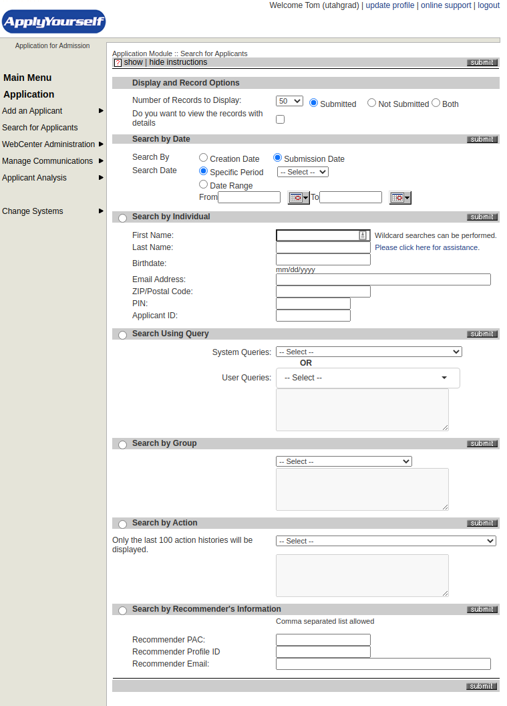
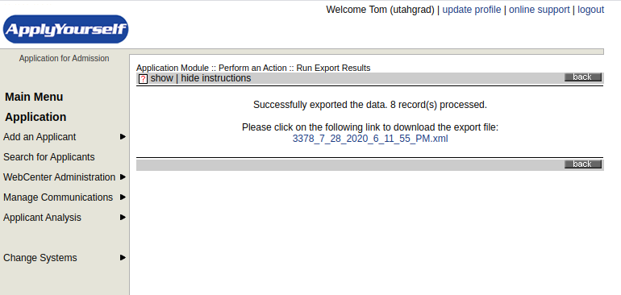
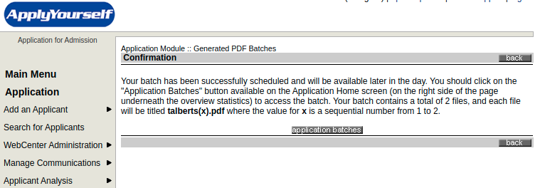

## Overview

This explains how to download user submitted data from the [ApplyYoursef](http://webcenter.applyyourself.com) system, which is the university contracted vendor for graduate applications. Data is downloaded in two distinct formats: XML and PDF. XML data is processed by Python scripts and inserted into our own database (hosted on department servers) while PDF files are sorted and split on the server's filesystem for viewing through a web browser.

This section *only* describes how to download the data from ApplyYourself.

**Note that to use these instructions you must have an account for the ApplyYourself system. Contact Paula Tooman to obtain one.**

## Applicant Data

We download data submitted by applicants in two ways: in XML format containing the raw field data as entered by the applicant, and as a PDF file that contains both the XML data *and* any supplementary files like transcripts, reference letters, CVs, etc. Below are the instructions for downloading it from the ApplyYourself system.

#### Step-by-Step Instructions

1. Go to [webcenter.applyyourself.com](http://webcenter.applyyourself.com) and login with your ApplyYourself credentials. The first thing you will see is this page:

2. Hover over **Select a System** option on the left hand side. Choose the **Application for Admission** option, which brings you to this screen:

3. Click on **Search for Applicants** on the left hand side, which brings you to this screen:

4. Under **Search by Date**, keep the **Submission Date** button clicked. Change the **Search Date** option to **Date Range**. In the **From** field put the date of the **Last Received Application Date**. The latter can be found on the [GradRecruit Main Page](http://www.math.utah.edu/gradrecruit/) or the [GradRecruit Admin Page](http://www.math.utah.edu/gradrecruit/admin.php). The format is *MM/DD/YYYY*.

5. In the **To** field put tomorrow's date. The format is *MM/DD/YYYY*.

6. Click the **Submit** button in the grey **Search by Date** bar.

7. The system takes some time to search, then brings you to a page that looks like this:

8. On the bottom right look for the **Select an Action** dropdown and change it to **Export**. In the options below that select **Apply to All**. Then click **go**. After some time the system will bring up options for the export format that look like this:

9. Go to the **Math** folder and expand it. Select the **MathXML** option. (*Note the other options may be deleted at some point, so you may see fewer than in the image above*).

10. After you've selected **MathXML** press **Run** in the top right corner. The system will take some time and bring you to a page that looks like this:
 
11. Click on the link to download the XML file. Remember where the file gets saved to (typically your *Downloads* folder) and rename it to **AppsNew.xml**

12. On the page where the link to the XML file was click one of the two grey **back** buttons that surround the XML file name. That brings you back to this page:

13. On the bottom right look for the **Select an Action** dropdown and change it to **Generate PDF**. In the options below that select **Apply to All**. Then click **go**. It will bring you to a screen that looks like this:

14. Make sure the options clicked match those in the image above. You should only need to click **Include Bookmarks** (very important) and **Check here to include all submitted Recommendations affiliated with the selected applicants** (also very important). The other options should already be checked, and the PDF file should already say *3378.pdf*.
15. Click **Generate PDF**. This may take some time, but it will either:
    * Open a new browser window and slowly load the PDF in that window. All the applications that you’ve selected will be merged into a single PDF. You need to save this PDF to your computer: remember where you save it and what you name it. The typical name is *Application.pdf*
    * If there were more than 10 records to export, the system puts the applications into groups of 10 to keep the PDFs from being too large. Rather than opening a new window, the website switches to a page that says something like this:
    
    Give the system some time to generate the batches. It doesn’t take very long, maybe about 1 minute per 10 applications that there were. After some time click on the application batches button above. It will bring you to a page that look like this:
    
Click on the blue links to download the files. Remember where they get saved on your computer. After you have downloaded batch PDF files you can click the checkbox in ApplyYourself and delete them. Otherwise they will be there the next time you go to download files and you will likely forget which are the current ones.
16. This completes the steps for downloading applicant data. At this point it is usually most convenient to download the recommender data also, which is explained in the next section, but you can also go to the [instructions on how to upload the applicant data to GradRecruit](../upload/upload.md).
 
## Recommender Data

We download data submitted by recommenders *only* in XML format. This data includes the recommender name, email, institution, a few other things, and their answers to the questions that ApplyYourself asks them about the applicants. It does **not** include the actual letter itself. The letter is included with the PDF file for the applicant.

This section *only* describes how to download the data from ApplyYourself.

**Note that to use these instructions you must have an account for the ApplyYourself system. Contact Paula Tooman to obtain one.**

#### Step-by-Step Instructions

1. Go to [webcenter.applyyourself.com](http://webcenter.applyyourself.com) and login with your ApplyYourself credentials. The first thing you will see is this page:
. If you are already in ApplyYourself you can skip to the next step.
2. Hover over **Select a System** option on the left hand side (if already in ApplyYourself click on **Change Systems**). Choose the **Recommendation Provider Form** option, which brings you to this screen:

3. On the left hand navigation pane click on **Search for Recommender**. It brings you to a search page that looks like this:

4. You can keep the initial options all the same. Under **Search by Date** keep **Submission Date** selected, then select **Date Range**. In the **From** field put the **Last Received Recommendation Date** that you copied from the gradrecruit administration page. In the **To** field you can put tomorrow’s date, but you can also just leave it blank. Then hit one of the **submit** buttons. It brings you to a page that looks like:

5. The bottom right of the page should look something like this:

Change the dropdown menu to **Export**, and change the radio button to **Apply to all**. Then hit the **go** button.
6. You then come to a page that lets you choose an export format. As in the image below choose the **Mathematics** option. That is all you need to click, and then press **run**.

7. After a few seconds that brings you to a page that looks like this

Click on the blue text to download the XML file. Remember where it downloads to (usually your *Downloads* folder), and go change the filename to **RecsNew.xml**
8. This completes the steps for downloading recommender data.
