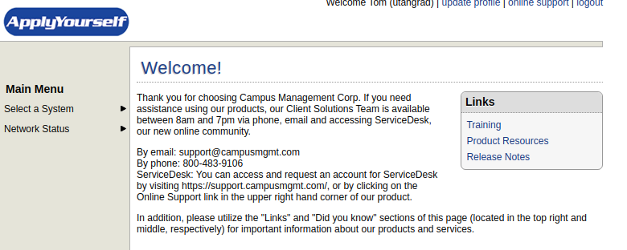

## Overview

This explains how to obtain updated data from the ApplyYourself system. This must be done to keep reference letter information in sync. Since applicants and letter writers submit data at different times we have to do a few extra steps to make sure the two are always in sync. The possibilities for what can happen are:

+ **The most common**: Applicants submit their data *before* letter writers submit their letters. But our system downloads the PDF letters with the applicant data, so quite commonly we download applicant PDF packets that are missing at least one reference letter. So we have to go back later and re-download those PDF packets once the missing letters have been submitted. Our system keeps track of which packets need to be re-downloaded, however, which should make our life easier.
+ **Rarer but still possible**: After submitting their application, applicants can change their reference letter writers. They can add more writers or take away old ones. Therefore we need to update the list of letter writers than an applicant has requested from. Our system can also keep track of when we need to do this.

The sections below tell us how to update this data. 

## Downloading Updated Letters

**Note that to use these instructions you must have an account for the ApplyYourself system. Contact Paula Tooman to obtain one.**

1. Go to the GradRecruit Admin page. You should see something that looks like this:

2. Under *Recommendation Letter Status* you will likely see lists of Applicant IDs. These are applicants for whom not all letters have been uploaded into our system yet. They are displayed in this list format so they can be easily copy-and-paste into ApplyYourself for easy fetching.
Typically you will want to use the first two lists, i.e. *Applicant IDs with missing letters for Fall 2022* or *All Applicant IDs with missing letters where application was submitted in last 90 days*. The last list returns applicants from all time that are still missing letters, but usually those are old and the letter writer has just forgotten about the submission.
3. Copy the string of Applicant IDs whose letters you want to update.
4. Go to [webcenter.applyyourself.com](http://webcenter.applyyourself.com) and login with your ApplyYourself credentials. The first thing you will see is this page:

5. Hover over **Select a System** option on the left hand side. Choose the **Application for Admission** option, which brings you to this screen:

6. Click on **Search for Applicants** on the left hand side, which brings you to this screen:
 
7. Under **Search by Individual**, paste the string that you copied from the GradRecruit Admin page into the **Applicant ID** field. Then hit the grey **submit** button.
8. Now you follow the standard instructions for downloading applicant XML and PDF data from GradRecruit. Here I copy the text, see steps 7-15 of the [Downloading New](download.md) instructions.
9. On the bottom right of the search results page look for the **Select an Action** dropdown and change it to **Export**. In the options below that select **Apply to All**. Then click **go**. After some time the system will bring up options for the export format.
10. Go to the **Math** folder and expand it. Select the **MathXML** option. (*Note the other options may be deleted at some point, so you may see fewer than in the image above*).
11. After you've selected **MathXML** press **Run** in the top right corner. 
12. After some time the system shows a link to an XML file. Click on the link to download the XML file. Remember where the file gets saved to (typically your *Downloads* folder) and rename it to **AppsUpdate.xml**
12. On the page where the link to the XML file was click one of the two grey **back** buttons that surround the XML file name. 
13. On the bottom right look for the **Select an Action** dropdown and change it to **Generate PDF**. In the options below that select **Apply to All**. Then click **go**. It will bring you to the PDF export options page.
14. Make sure to click **Include Bookmarks** (very important) and **Check here to include all submitted Recommendations affiliated with the selected applicants** (also very important). The other options should already be checked, and the PDF file should already say *3378.pdf*.
15. Click **Generate PDF**. This may take some time, but it will either:
    * Open a new browser window and slowly load the PDF in that window. All the applications that you’ve selected will be merged into a single PDF. You need to save this PDF to your computer: remember where you save it and what you name it. The typical name is *Application.pdf*
    * If there were more than 10 records to export, the system puts the applications into groups of 10 to keep the PDFs from being too large. Rather than opening a new window, the website switches to a page that says application batches are being generated. Give the system some time to generate the batches. It doesn’t take very long, maybe about 1 minute per 10 applications that there were. After some time click on the application batches button above. Click on the blue links to download the files. Remember where they get saved on your computer. After you have downloaded batch PDF files you can click the checkbox in ApplyYourself and delete them. Otherwise they will be there the next time you go to download files and you will likely forget which are the current ones.
    
## Uploading Updated Letters

After downloading the data as above you can simply [follow the standard steps for uploading data](upload.md) to the webserver.

## Processing Updated Letters

**To complete the steps below you need to have access to the GradRecruit file system. Usually only one person has this access to this file system. Currently that person is Tom Alberts, but soon we will switch it to Paula Tooman.**

**If you don't have such access you need to contact Pieter Bowman, who can grant it to you. Show these instructions to him and he will know what needs to be done.**

### Quick Commands

These commands assume that the XML file containing updated applicant info is called **AppsUpdate.xml**

    setenv PATH /usr/uumath/ashare/anaconda/anaconda3/bin:$PATH
    source /usr/uumath/ashare/anaconda/anaconda3/etc/profile.d/conda.csh
    conda activate py3
    python3 importApps.py ../../Files/New/AppsUpdate.xml --DBupdate
    python3 pdfsplitter.py ../../Files/New/*.pdf
    conda deactivate

**After you have successfully executed these commands you should delete the files in the /Files/New/ directory on the department server.**

You can then disconnect from the webserver, if finished updating files. 

### Detailed Explanation

This section explains in depth what each of the commands above is doing.

1.  Accessing the department Python:

        setenv PATH /usr/uumath/ashare/anaconda/anaconda3/bin:$PATH
        source /usr/uumath/ashare/anaconda/anaconda3/etc/profile.d/conda.csh
    
    These commands activate anaconda, which is used by Python on the department webservers. If this ever doesn't work we need to contact Pieter Bowman.
    
2.  Activating the Python Environment:

        conda activate py3
    
    py3 is the environment used by our Python scripts. **This command will only work if this environment has already been installed for your user.** 
    
3.  Update the list of reference letter writers requested by each applicant.

				python3 importApps.py ../../Files/New/AppsUpdate.xml --DBupdate

    Actually this fully overwrites the data for that applicant with the most recent applicant. That is the effect of the *--DBupdate* option. However the only data that should have possibly changed is the list of letter writers, along with a flag indicating whether or not all reference letters for that applicant have been submitted.
    
4.  Split the downloaded pdf files into multiple pieces

        python3 pdfsplitter.py ../../Files/New/*.pdf
        
    This program takes the applicant PDF files and splits them into multiple pieces. This is what allows us to look at individual pieces of the application (letters, transcripts, etc) on the webpage. This program assumes that a directory for each applicant has already been created. This should have happened when the applicant's info was first submitted to the GradRecruit database. The PDF files being split here will mostly already be present in the applicant's directory, but a few more letters may be added.
    
5.  Deactivate the python environment

        conda deactivate  
        
## Using the Letter Auditor

Even by following the steps above it is still possible for applications and letters to be out of sync with each other. Letter Auditor is a tool that helps to keep them matched. Users with admin privilege should be able to access the Letter Auditor under the Admin heading of the navbar. The way it works is the following:

*   On entering the Letter Auditor page it will let you choose which subset of applicants to audit. Usually you will choose the default **Current Term**, but other options are available.
*   The server performs the audit. It runs through the selected list of applicants and for each one checks:

    +  **Applicant XML data needs updating**: if the server finds reference letter data from someone who is *not* in that applicant's list of requested letter writers, it means that our version of the list is out of date. So it needs to be updated. 
    +  **Applicant PDF file needs updating**: if the server finds that a reference letter was submitted for the applicant (because we have the recommender's XML data) but we don't have a copy of the PDF on our file system, then we need to re-download the applicant's PDF packet and split it up. This will **not** pick up applicant's for whom the recommender simply hasn't submitted a letter yet.
    +  **Recommender XML data needs updating**: Sometimes the reference letter ends up on our file system but we don't get the data submitted by the recommender (their answers to the questions we ask recommenders). So we need to re-download the recommender's XML data.

After running the letter auditor the results page looks something like this:

As in the above, the lists of IDs are useful for copy-and-paste into ApplyYourself. The next subsections explain what to do with each type.

### Initial Activation

Run these commands on the department server. You only need to run them once at the beginning:

    setenv PATH /usr/uumath/ashare/anaconda/anaconda3/bin:$PATH
    source /usr/uumath/ashare/anaconda/anaconda3/etc/profile.d/conda.csh
    conda activate py3

### AppIDs whose XML needs to be updated

1.  If the letter auditor lists nothing in this subsection you can skip this.
2.  Follow steps 3-12 in this page's instructions for [Downloading Updated Letters](#downloading-updated-letters). In Step 7 when you search for applicants use the list of AppIDs that you copied from this section of the letter auditor.  
3.  Follow the steps in this page's instructions for [Uploading Updated Letters](#uploading-updated-letters).
4.  Run this command on the department webserver. **This assumes that the XML file you uploaded on the last step was renamed AppUpdates.xml**

        python3 importApps.py ../../Files/New/AppsUpdate.xml --DBupdate

### AppIDs whose PDF needs to be updated

1.  If the letter auditor lists nothing in this subsection you can skip this.
2.  Follow steps 3-7 and 14-16 in this page's instructions for [Downloading Updated Letters](#downloading-updated-letters). In Step 7 when you search for applicants use the list of AppIDs that you copied from this section of the letter auditor.  
3.  Follow the steps in this page's instructions for [Uploading Updated Letters](#uploading-updated-letters).
4.  Run this command on the department webserver. 

        python3 pdfsplitter.py ../../Files/New/*.pdf

### RecIDs whose XML needs to be updated 

1.  If the letter auditor lists nothing in this subsection you can skip this.
2.  Go through the instructions for Downloading Recommender Data in the page on [Downloading New Data](download.md), with the following modification. In Step 4, instead of using Search by Date use **Search by Recommmender's Information**. In the **Recommender's Profile ID** field paste the list of RecIDs that you copied from this section of the letter auditor. Otherwise all the other steps remain the same.
3.  Follow the steps in this page's instructions for [Uploading Updated Letters](#uploading-updated-letters).
4.  Run this command on the department webserver. **This assumes that the XML file you uploaded on the last step was renamed RecsNew.xml**

        python3 importReccs.py ../../Files/New/RecsNew.xml -n newrecs.txt

### Deactivation

Run this command to deactivate the Python environment

    conda deactivate

### Run again

Whenver you run the letter auditor, after finishing you should run it a second time to make sure that the update didn't uncover any further updates to be performed. That shouldn't be the case but it is not guaranteed. However if new numbers appear you can go through the steps above again.
